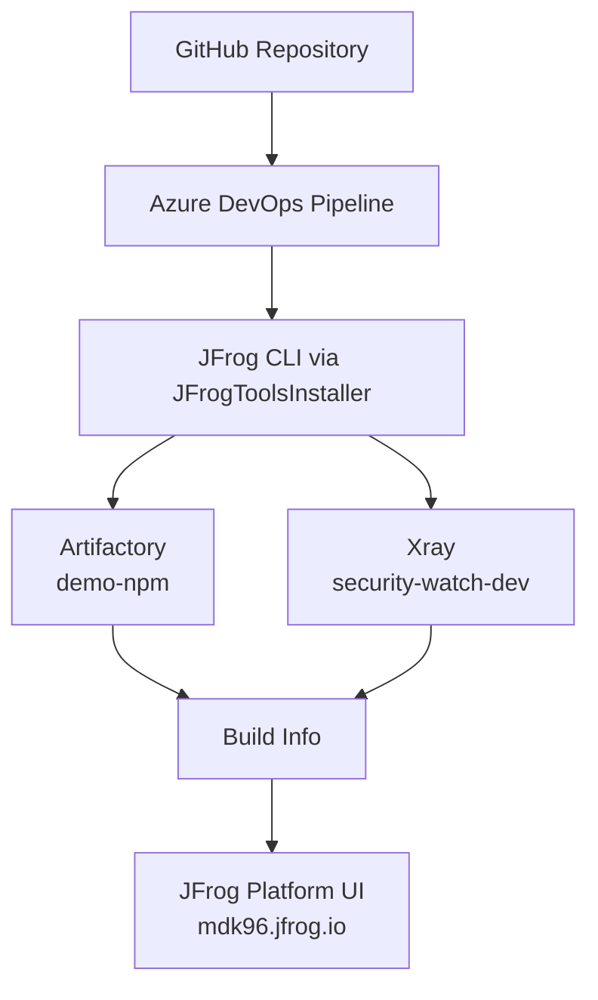

# JFrog<=>Azure DevOps Pipeline Integration Demo

Production-ready demo that builds a Node.js (Express) applicationn in **Azure DevOps**, resolves npm packages through **JFrog Artifactory**, and scans the build with **JFrog Xray** usingb the official **JFrog Azure DevOps Extension**.

JFrog Platform: [https://mdk96.jfrog.io/](https://mdk96.jfrog.io/)  
npm virtual repository: **`demo-npm`**

---

## 1. Project Overview

This repository is a customer-demo blueprint. Push it to GitHub, wire it to Azure DevOps once, and every subsequent commit triggers a CI pipeline that:

1. Installs the JFrog CLI from Artifactory (`jfrog-cli-remote`)
2. Audits project dependencies with Xray (`security-watch-dev`)
3. Runs `npm install` through Artifactory (`demo-npm`) while collecting build info
4. Stamps a unique package version (`1.0.<BuildId>`)
5. Packs and publishes the npm package to **`demo-npm-local`**
6. Collects tracked issues (JIRA-style commit messages)
7. Publishes build info to Artifactory
8. Scans the published build with Xray

The sample app is intentionally small so demos stay focused on the JFrog + Azure DevOps integration, not application complexity.

> **Security demo (`develop` branch):** the `develop` branch intentionally pins npm dependencies with **known Critical CVEs** so the **Xray Build Scan** stage surfaces policy violations against `security-watch-dev`. The `main` branch stays clean. Use `develop` to demonstrate shift-left security failing a build.
>
> | Package | Version | Example CVE | Severity |
> |---------|---------|-------------|----------|
> | `lodash` | `4.17.11` | CVE-2019-10744 (prototype pollution) | Critical |
> | `minimist` | `1.2.0` | CVE-2021-44906 (prototype pollution) | Critical |
> | `handlebars` | `4.0.11` | CVE-2019-19919 (prototype pollution) | Critical |
> | `node-serialize` | `0.0.4` | CVE-2017-5941 (RCE via deserialization) | Critical |
> | `growl` | `1.9.2` | CVE-2017-16042 (command injection) | Critical |

---

## 2. Architecture Diagram



**Flow in plain language**

| Step | Component | What happens |
|------|-----------|--------------|
| Push | GitHub | Commit triggers Azure DevOps CI |
| Install | JFrog CLI | Pipeline agents get CLI from `jfrog-cli-remote` |
| Audit | Xray | Local dependency tree checked against `security-watch-dev` |
| Resolve | Artifactory | `npm install` via virtual repo `demo-npm` |
| Deploy | Artifactory | Pack & publish package to local repo `demo-npm-local` |
| Publish | Build Info | Metadata (deps, artifacts, env, issues) stored in Artifactory |
| Scan | Xray | Published build scanned for policy violations |

---

## 3. Prerequisites

| Prerequisite | Why you need it |
|--------------|-----------------|
| **Azure DevOps Organization** | Hosts the pipeline and service connections |
| **GitHub account** | Source control; Azure DevOps watches this repo for pushes |
| **JFrog Platform** | [https://mdk96.jfrog.io/](https://mdk96.jfrog.io/) |
| **Artifactory** | Resolves npm packages and stores build info |
| **Xray** | Dependency audit + build scan |
| **Azure DevOps JFrog Extension** | Provides `JFrogToolsInstaller`, `JFrogNpm`, `JFrogAudit`, etc. |
| **JFrog CLI** (local) | Verify authentication before configuring Azure DevOps |
| **Node.js 18+** (local) | Run the sample app on your machine |
| **Access token in `~/.zshrc`** | `JFROG_URL` and `JFROG_TOKEN` (already configured on this machine) |

Existing Artifactory repositories used by this demo:

- **`demo-npm`** — npm virtual repository (resolve dependencies)
- **`demo-npm-local`** — npm local repository (publish the built package)
- **`jfrog-cli-remote`** — generic remote repository used by `JFrogToolsInstaller` to download the CLI (must proxy `https://releases.jfrog.io/artifactory/jfrog-cli/v2-jf/`)

---

## 4. Clone the Project

```bash
git clone https://github.com/<YOUR_ORG>/jfrog-azure-devops-pipeline-integration.git
cd jfrog-azure-devops-pipeline-integration
```

If this is still a local folder (before the first GitHub push):

```bash
cd jfrog-azure-devops-pipeline-integration
```

---

## 5. Load Environment Variables

### How the token is read from `~/.zshrc`

This machine already stores credentials in `~/.zshrc`:

```bash
export JFROG_URL="https://mdk96.jfrog.io"
export JFROG_TOKEN="<your-access-token>"
```

**Never commit the token.** Helper scripts read it from `~/.zshrc` only.

### Expected environment variables

| Variable | Purpose |
|----------|---------|
| `JFROG_URL` | Platform base URL (`https://mdk96.jfrog.io`) |
| `JFROG_TOKEN` | JFrog access token |
| `JF_URL` | Alias exported for JFrog CLI (set automatically by `load-env.sh`) |
| `JF_ACCESS_TOKEN` | Alias exported for JFrog CLI (set automatically by `load-env.sh`) |

### Source via the helper script (recommended)

```bash
source scripts/load-env.sh
```

Or source `.zshrc` directly:

```bash
source ~/.zshrc
```

### Verify the variables are loaded

```bash
echo "$JFROG_URL"
# Expected: https://mdk96.jfrog.io

# Confirm the token exists without printing it
[[ -n "$JFROG_TOKEN" ]] && echo "JFROG_TOKEN is set (${#JFROG_TOKEN} chars)" || echo "JFROG_TOKEN is missing"
```

---

## 6. Verify JFrog Authentication

Run the verification script **before** configuring Azure DevOps:

```bash
chmod +x scripts/*.sh
./scripts/verify-jfrog.sh
```

What it does:

1. Loads `JFROG_URL` / `JFROG_TOKEN` from `~/.zshrc`
2. Configures a temporary JFrog CLI server
3. Pings Artifactory at `https://mdk96.jfrog.io/`
4. Confirms access to the **`demo-npm`** virtual repository
5. Checks for **`jfrog-cli-remote`** (required by the pipeline installer task)

### Manual CLI checks (optional)

```bash
source scripts/load-env.sh

jf config add mdk96-demo \
  --url="$JF_URL" \
  --access-token="$JF_ACCESS_TOKEN" \
  --interactive=false \
  --overwrite=true

# Platform / Artifactory health
curl -H "Authorization: Bearer $JF_ACCESS_TOKEN" \
  "$JF_URL/artifactory/api/system/ping"
# Expected body: OK

# Confirm demo-npm
curl -H "Authorization: Bearer $JF_ACCESS_TOKEN" \
  "$JF_URL/artifactory/api/repositories/demo-npm" | jq '{key,rclass,packageType}'
```

When verification succeeds, proceed to GitHub and Azure DevOps.

### Full local app setup

```bash
./scripts/setup.sh
npm start
# In another terminal:
curl http://localhost:3000/health
curl http://localhost:3000/api/info
```

---

## 7. Push the Project to GitHub

1. Create a new empty repository on GitHub (no README/license if you already have local files).
2. From this project root:

```bash
git init
git add .
git commit -m "Initial commit: JFrog Azure DevOps pipeline demo"
git branch -M main
git remote add origin https://github.com/<YOUR_ORG>/jfrog-azure-devops-pipeline-integration.git
git push -u origin main
```

Subsequent pushes to `main` / `master` / `develop` trigger the Azure DevOps pipeline (once connected).

---

## 8. Connect GitHub to Azure DevOps

1. Sign in to your **Azure DevOps Organization**.
2. **Create a project** (for example: `JFrog-Azure-DevOps-Demo`).
3. Go to **Project Settings → Service connections → New service connection → GitHub**.
4. Authorize Azure DevOps to access your GitHub account/org.
5. Create a pipeline that uses the GitHub repository (see [§14](#14-create-the-pipeline)).
6. Ensure **CI triggers** are enabled:
   - Pipeline YAML already includes `trigger` for `main`, `master`, and `develop`.
   - In Azure DevOps: **Pipelines → your pipeline → Edit → … → Triggers** and confirm continuous integration is on.

Alternative: **Repos → Files → Import repository** from GitHub if you prefer Azure Repos mirroring. For this demo, keeping the source on GitHub with an Azure Pipeline trigger is the typical customer story.

---

## 9. Install the JFrog Azure DevOps Extension

1. Open the [JFrog Azure DevOps Extension](https://marketplace.visualstudio.com/items?itemName=JFrog.jfrog-azure-devops-extension) in the Visual Studio Marketplace.
2. Click **Get it free** and install it into your Azure DevOps organization.
3. Confirm installation:
   - **Organization Settings → Extensions** — JFrog extension listed as installed  
   - When editing a pipeline, tasks such as `JFrogToolsInstaller`, `JFrogNpm`, `JFrogAudit`, `JFrogPublishBuildInfo`, and `JFrogBuildScan` appear in the task catalog

---

## 10. Configure Service Connections

Go to **Project Settings → Service connections → New service connection**.

Use the same access token stored in `~/.zshrc` (`JFROG_TOKEN`). Do not hardcode tokens in YAML.

### JFrog Platform Service Connection

Prefer **JFrog Platform V2** (not Artifactory V2) for this demo. You may already have one named `jfrog-platform`.

| Field | Value |
|-------|--------|
| Connection type | **JFrog Platform V2** |
| Authentication method | Token Based Authentication |
| Server URL | `https://mdk96.jfrog.io` (**no trailing slash**, **do not** append `/artifactory`) |
| Access Token | Value of `JFROG_TOKEN` from `~/.zshrc` |
| Service connection name | e.g. `jfrog-platform` — **must match** the `jfrogPlatformConnection` pipeline variable |
| Grant access to all pipelines | Recommended for demos (check the box) |

Click **Verify** — it should succeed against the platform root URL.

> **If you create “JFrog Artifactory V2” instead**, Azure DevOps calls `{Server URL}/api/plugins`. That requires the Artifactory path:
> `https://mdk96.jfrog.io/artifactory`
>
> Using only `https://mdk96.jfrog.io/` with Artifactory V2 produces:
> `404` on `https://mdk96.jfrog.io/api/plugins` — the token is fine; the URL type is wrong.

### JFrog Xray Service Connection

| Field | Value |
|-------|--------|
| Connection type | **JFrog Xray V2** |
| Authentication method | Token Based Authentication |
| Server URL | `https://mdk96.jfrog.io` (platform root), or `https://mdk96.jfrog.io/xray` if Verify requires the Xray path |
| Access Token | Same `JFROG_TOKEN` |
| Service connection name | e.g. `jfrog-xray` — **must match** the `jfrogXrayConnection` pipeline variable |
| Grant access to all pipelines | Recommended for demos |

After creating both connections, click **Verify** / **Verify connection** if available.

---

## 11. Configure Artifactory

This demo uses the **existing** npm repositories:

| Repository | Type | Role |
|------------|------|------|
| **`demo-npm`** | Virtual (npm) | Resolve all pipeline `npm install` traffic |
| **`demo-npm-local`** | Local (npm) | Receive the packed package from `pack and publish` |
| **`demo-npm-remote`** | Remote (npm) | Proxy upstream npm (member of `demo-npm`) |

The pipeline resolves with:

```yaml
sourceRepo: 'demo-npm'
```

And publishes with:

```yaml
targetRepo: 'demo-npm-local'   # or $(targetRepo)
```

Do **not** change the resolve repo to `npm-virtual` or create another npm virtual repository for this demo.

Also ensure **`jfrog-cli-remote`** exists as a **generic remote** repository whose URL is:

```text
https://releases.jfrog.io/artifactory/jfrog-cli/v2-jf/
```

> Important: the path must end with **`/v2-jf/`**. The Azure DevOps `JFrogToolsInstaller` downloads  
> `{repo}/{version}/jfrog-cli-linux-amd64/jf`, so the remote must already be rooted at `v2-jf`.  
> Using only `.../jfrog-cli/` causes HTTP 404.

`JFrogToolsInstaller@1` downloads the CLI from that repository. If it is missing, ask a JFrog admin to create it (or create it under **Administration → Repositories → Add Repositories → Remote Repository → Generic**).

---

## 12. Configure Xray

Create (or reuse) a watch named exactly **`security-watch-dev`** — the pipeline references this name.

### Create a Security Policy

1. In the JFrog Platform UI: **Xray → Security → Policies → New Policy**.
2. Type: **Security**.
3. Add rules appropriate for a demo (example: fail / raise violation on High/Critical CVEs, or a simple severity threshold).
4. Save the policy.

### Create a Watch

1. **Xray → Watches → New Watch**.
2. Name: **`security-watch-dev`** (exact match required).
3. Attach the security policy created above.
4. Add **`demo-npm`** as a watched resource (repository).
5. Save.

### Attach the Watch to `demo-npm`

Xray watches attach to **local** and **remote** repositories (not virtual). For the `demo-npm` virtual repository, assign its members:

- `demo-npm-local`
- `demo-npm-remote`

This project already has a watch named **`security-watch-dev`** with policy **`security-policy-dev`** configured for those resources on [https://mdk96.jfrog.io/](https://mdk96.jfrog.io/).

The pipeline tasks that use this watch:

- `JFrogAudit@1` — `watches: 'security-watch-dev'`
- `JFrogBuildScan@1` — scans the published build (policies/watches applied to the build)

---

## 13. Configure Azure DevOps Variables

Open **Pipelines → your pipeline → Edit → Variables** (or use a Variable Group).

| Variable | Example value | Notes |
|----------|---------------|-------|
| `jfrogPlatformConnection` | `jfrog-platform` | Exact name of the Platform/Artifactory service connection |
| `jfrogXrayConnection` | `jfrog-xray` | Exact name of the Xray service connection |
| `buildName` | `jfrog-azure-devops-demo` | Appears under Artifactory Builds |
| `buildNumber` | `$(Build.BuildId)` | Unique per Azure DevOps run |
| `targetRepo` | `demo-npm-local` | Local npm repo that receives the published package |

`azure-pipelines.yml` already defines sensible defaults for these. Override them in the Azure DevOps UI when your service connection names differ.

---

## 14. Create the Pipeline

1. **Pipelines → New pipeline**.
2. Select **GitHub** and authorize if prompted.
3. Select this repository.
4. Choose **Existing Azure Pipelines YAML file**.
5. Path: `/azure-pipelines.yml`.
6. Review the steps, then **Save** (and optionally **Run**).

The YAML trigger block ensures the pipeline runs on every push to `main`, `master`, or `develop`.

---

## 15. Run the Pipeline

Trigger by pushing a commit to GitHub, or click **Run pipeline** in Azure DevOps.

| Order | Task | What you should see |
|-------|------|---------------------|
| 1 | **Install JFrog CLI & Tools** (`JFrogToolsInstaller`) | CLI downloaded from `jfrog-cli-remote` and available on the agent |
| 2 | **Audit Project Dependencies (Xray)** (`JFrogAudit`) | Shift-left scan against watch `security-watch-dev` |
| 3 | **NPM Install & Collect Build Info** (`JFrogNpm`) | Dependencies resolved from `demo-npm`; build info collected locally |
| 4 | **Stamp Unique Package Version** | `package.json` version set to `1.0.<BuildId>` |
| 5 | **Pack & Publish to demo-npm-local** (`JFrogNpm`) | `.tgz` published to Artifactory local repo `demo-npm-local` |
| 6 | **Collect Tracked Issues** (`JFrogCollectIssues`) | JIRA-style keys scraped from commit messages into build info |
| 7 | **Publish Build Info to Artifactory** (`JFrogPublishBuildInfo`) | Build appears under Artifactory → Builds |
| 8 | **Scan Published Build (Xray)** (`JFrogBuildScan`) | Xray scans the published build; may fail the job if `allowFailBuild` + violations |

`allowFailBuild: true` on audit/scan means policy violations can fail the pipeline — useful for realistic security demos.

---

## 16. Verify Results

Open [https://mdk96.jfrog.io/](https://mdk96.jfrog.io/) and verify each artifact of the run.

| What to verify | Where in the JFrog Platform |
|----------------|-----------------------------|
| **Published package** | Artifactory → **Artifacts** → `demo-npm-local` → `jfrog-azure-devops-demo/-/jfrog-azure-devops-demo-1.0.<BuildId>.tgz` |
| **Dependency Audit** | Xray → Scans / Watch `security-watch-dev` results for the run |
| **Build Info** | Artifactory → **Builds** → `jfrog-azure-devops-demo` → select the build number (`Build.BuildId`) |
| **Dependencies** | Inside the build → **Modules / Dependencies** (packages resolved via `demo-npm`) |
| **Published modules** | Inside the build → **Modules** (the npm package published to `demo-npm-local`) |
| **Environment Variables** | Inside the build → **Environment** (secrets matching `*password*;*token*;…` are excluded) |
| **Issues** | Inside the build → **Issues** (populated when commit messages match the JIRA regexp) |
| **Xray Scan Results** | Build page → **Xray** / Security data, or Xray → Builds |
| **Policy Violations** | Xray → **Watches** → `security-watch-dev` → Violations; also surfaced on the build |

Tip for demos: keep the Azure DevOps run and the Artifactory build page side-by-side.

---

## 17. Troubleshooting

| Symptom | Likely cause | Fix |
|---------|--------------|-----|
| Authentication failures in pipeline | Bad/expired token or wrong URL on service connection | Re-copy `JFROG_TOKEN` from `~/.zshrc`; re-verify service connections; Platform V2 URL must be `https://mdk96.jfrog.io` (no `/artifactory`) |
| **Verify failed** on Artifactory V2 (`…/api/plugins` → 404) | Used platform URL with **Artifactory V2** connection type | Either switch to **JFrog Platform V2** + `https://mdk96.jfrog.io`, or keep Artifactory V2 and set URL to `https://mdk96.jfrog.io/artifactory` |
| Invalid service connection | Name mismatch with pipeline variables | `jfrogPlatformConnection` / `jfrogXrayConnection` must equal the service connection **names** exactly |
| Repository not found / **`demo-npm` not found** | Wrong `sourceRepo` or missing permissions | Confirm `sourceRepo: 'demo-npm'`; grant the token read access to `demo-npm` |
| **`jfrog-cli-remote` errors** on ToolsInstaller | Remote URL missing `/v2-jf/` or repo missing | Set remote URL to `https://releases.jfrog.io/artifactory/jfrog-cli/v2-jf/`; token needs Read+Deploy on the remote (for cache) |
| Xray Watch missing | Watch name typo | Create watch named exactly `security-watch-dev` and attach `demo-npm` |
| npm install failures | Network, auth, empty virtual repo, or **lockfile pinned to another registry** | Confirm `demo-npm` members; check `JFrogNpm` logs. If you see URLs like `jfrogrepo24.jfrog.io` or another host, regenerate `package-lock.json` through `demo-npm` (`jf npm-config --repo-resolve=demo-npm` then `rm package-lock.json && jf npm install`) and push |
| npm publish failures | Missing Deploy permission, wrong `targetRepo`, or version already exists | Grant Deploy on `demo-npm-local`; confirm `targetRepo: demo-npm-local`; version stamping (`1.0.$(Build.BuildId)`) should avoid collisions |
| Build Info not published | Earlier step failed or publish task misconfigured | Ensure `JFrogNpm` ran with `collectBuildInfo: true` and the same `buildName` / `buildNumber` as publish |
| Xray scan failures | Violations with `allowFailBuild: true`, or Xray connection issue | Review violations in UI; adjust policy for demos or fix vulnerable deps; verify Xray service connection |
| Local `./scripts/verify-jfrog.sh` fails | Token not loaded | Run `source scripts/load-env.sh` and confirm `JFROG_URL` / `JFROG_TOKEN` |
| Pipeline does not auto-start | Trigger/branch mismatch or GitHub connection | Push to `main`/`master`/`develop`; re-check GitHub service connection and CI triggers |

---

## Project Structure

```text
jfrog-azure-devops-pipeline-integration
├── azure-pipelines.yml      # CI definition (JFrog extension tasks)
├── package.json
├── package-lock.json
├── index.js                 # Express entry point
├── .gitignore
├── README.md
├── routes/
│   ├── health.js            # GET /health
│   └── info.js              # GET /api/info
└── scripts/
    ├── load-env.sh          # Load JFROG_* from ~/.zshrc
    ├── verify-jfrog.sh      # Ping platform + verify demo-npm
    └── setup.sh             # Load env, verify, npm install
```

---

## Sample Application API

| Method | Path | Description |
|--------|------|-------------|
| `GET` | `/` | Welcome + endpoint list |
| `GET` | `/health` | Liveness JSON |
| `GET` | `/api/info` | App metadata (includes `demo-npm` reference) |

```bash
npm install
npm start
```

---

## License

MIT — intended for JFrog customer demonstrations.
